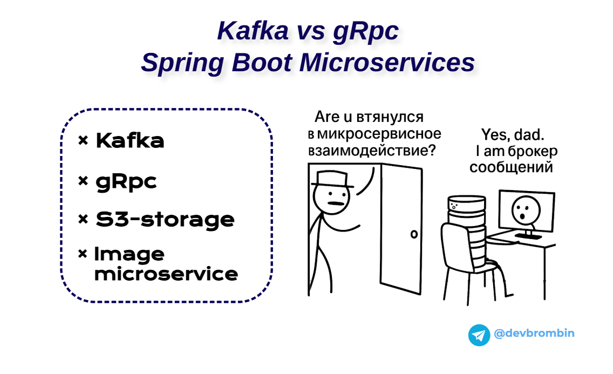

  <h1 align="center">Привет, это Бромбин Андрей! 👋</h1>
  <h3 align="center">Java Backend разработчик</h3>

## Обо мне

Java Backend разработчик, выпускник МГТУ им. Баумана, магистрант ВШЭ по направлению: "Проектирование и разработка высоконагруженных информационных систем". Пишу статьи, создаю масштабируемые и надежные решения, 
каждый день совершенствую свои навыки, изучая новые для меня технологии.

## 📰 Блог

Читайте мои статьи о Java, разработке и архитектуре на [Habr](https://habr.com/ru/users/br0mberg/)!

Также, присоединяйтесь к [Telegram-каналу](https://t.me/devbrombin)
<!-- BLOG-POST-LIST:START -->
<!-- BLOG-POST-LIST:END -->

## Навыки и технологии

*   **Языки:** Java, SQL, C/C++, Python, Groovy
*   **Frameworks:** Spring Framework (Boot, Security, Data, MVC), Quarkus
*   **Базы данных:** PostgreSQL, Greenplum, RabbitMQ, Redis, MongoDb
*   **Инструменты:** Git, Docker, Apache Kafka, Keycloak, Linux, Apache Nifi - etl, gRPC, AltCraft, CMOcean, Airflow
*   **CI/CD:** Gitlab CI, BitBucket
*   **Containerization:** Docker, Harbor, Kubernetes

# Проекты

*   **[SupportDesk-ImageService](https://github.com/br0mberg/SupportDesk-ImageService)**
    *   Сервис для обработки изображений в приложениях поддержки.
*   **[SupportDesk-IncidentService](https://github.com/br0mberg/SupportDesk-IncidentService)**
    *   Сервис для управления инцидентами в приложениях поддержки.
*   **[SupportDesk-RagService](https://github.com/br0mberg/SupportDesk-IncidentRetrievalService/tree/main)**
    *   Сервис для предобработки инцидентов с помощью больших языковых моделей (LLM).
*   **[SupportDesk-UserService](https://github.com/br0mberg/SupportDesk-UserService)**
    *   Сервис для управления пользователями в приложениях поддержки.
*   **[Java-GOF-patterns](https://github.com/br0mberg/GOF-patterns-java)**
    *   Практические примеры паттернов GOF (банды четырёх).
*   **[XMLsignAndValidate](https://github.com/br0mberg/XMLsignAndValidate)**
    *   Библиотека для подписи и проверки XML-документов.

<h2>📰 Лучшие мои статьи</h2>

<table>
  <tr>
    <td width="50%" align="center" valign="top">
      <a href="https://habr.com/p/924100/">
        
         
        <b>RAG и векторные БД: НЕ Сизифов LLM на Java и Spring AI</b>
      </a>
    </td>
    <td width="50%" align="center" valign="top">
      <a href="https://habr.com/p/912502/">
        
         
        <b>Как я реализовал взаимодействие микросервисов — Kafka и gRpc</b>
      </a>
    </td>
  </tr>
  <tr>
    <td width="50%" align="center" valign="top">
      <a href="https://habr.com/p/957914/">
        
         
        <b>Паттерны ООП, так не издевались даже… Структурные шаблоны с примерами на Java</b>
      </a>
    </td>
    <td width="50%" align="center" valign="top">
      <a href="https://habr.com/p/955604/">
        
         
        <b>Паттерны ООП с примерами на Java: порождающие шаблоны</b>
      </a>
    </td>
  </tr>
</table>

## ✉️ Контакты

*   **Email:** [andrey@brombin.ru](mailto:andrey@brombin.ru)
