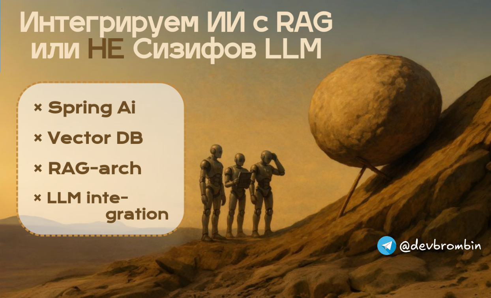
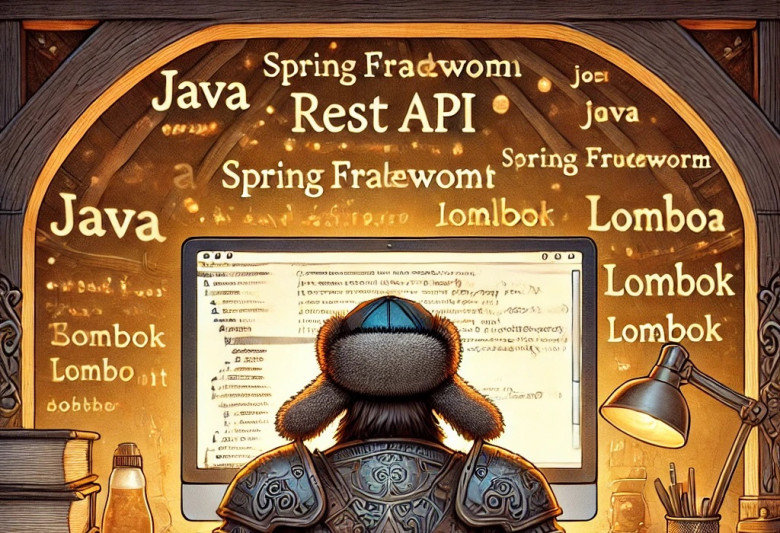

  <h1 align="center">Привет, я Андрей! 👋</h1>
  <h3 align="center">Java Backend разработчик</h3>

## Обо мне

Выпускник МГТУ им. Баумана, Java Backend разработчик. Создаю масштабируемые и надежные решения, 
постоянно совершенствуя свои навыки и изучая новые технологии.

## 📰 Блог

Читайте мои статьи о Java, разработке и архитектуре на [Habr](https://habr.com/ru/users/br0mberg/)!

Также, присоединяйтесь к [Telegram-каналу](https://t.me/devbrombin)
<!-- BLOG-POST-LIST:START -->
<!-- BLOG-POST-LIST:END -->

## 🛠️ Навыки и технологии

*   **Языки:** Java, SQL, C/C++, Python
*   **Frameworks:** Spring Framework (Boot, Security, Data, MVC), Quarkus, gRPC
*   **Базы данных:** PostgreSQL, Greenplum, RabbitMQ, Redis
*   **Инструменты:** Git, Docker, Docker Compose, Apache Kafka, Keycloak, Linux
*   **Cloud:** AWS (в процессе изучения)
*   **CI/CD:** Gitlab CI
*   **Containerization:** Kubernetes

# 🚀 Проекты

*   **[SupportDesk-ImageService](https://github.com/br0mberg/SupportDesk-ImageService)**
    *   Сервис для обработки изображений в приложениях поддержки.
*   **[SupportDesk-IncidentService](https://github.com/br0mberg/SupportDesk-IncidentService)**
    *   Сервис для управления инцидентами в приложениях поддержки.
*   **[SupportDesk-RagService](https://github.com/br0mberg/SupportDesk-IncidentRetrievalService/tree/main)**
    *   Сервис для предобработки инцидентов с помощью больших языковых моделей (LLM).
*   **[SupportDesk-UserService](https://github.com/br0mberg/SupportDesk-UserService)**
    *   Сервис для управления пользователями в приложениях поддержки. Разработан с использованием Quarkus.
*   **[JMarket](https://github.com/br0mberg/JMarket)**
    *   Приложение онлайн-маркетплейса.
*   **[XMLsignAndValidate](https://github.com/br0mberg/XMLsignAndValidate)**
    *   Библиотека для подписи и проверки XML-документов.

# 📰 Лучшие статьи

[SLAM на Java с OpenCV: сравнение алгоритмов автономной навигации](https://habr.com/ru/articles/866092/)

## ✉️ Контакты

*   **Email:** [andrey@brombin.ru](mailto:andrey@brombin.ru)
